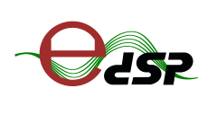

  

[![Build Status][travis-badge]][travis-link]
[![codecov][codecov-badge]][codecov-link]

*eDSP* (easy Digital Signal Processing) is a digital signal processing framework written in modern C++ that implements some of the common functions and algorithms frequently used in digital signal processing, audio engineering & telecommunications systems.

It aims to provide efficient and streamlined base calculations while at the same time having a straightforward and easy-to-use interface similar to another numeric language like [MATLAB](https://www.mathworks.com/products/matlab.html). The library integrates a C++ and Python interfaces and supports Windows, Linux, Mac OS, iOS and Android. 

### Yet another DSP framework?

Got it! Excellent question! There are plenty of established DSP frameworks for C++. You may be wondering,  What's the point of implementing other DSP framework? What does *eDSP* bring to the party  that differentiates it from these?

*eDSP is a modern framework written for modern C++ developers*. It is an alternative for those who want a powerful template DSP library that keeps a simple STL-like API. *eDSP* is a framework that:

- Is implemented as a **Headers only** library, just copy and use.
- Is **Template library**: supports single and double floating point, and fixed-point operations.
- Integrates an **easy** to use interface,  **STL-like API**. 
- Provides **fast** implementations: check the available [benchmarks](https://github.com/mohabouje/eDSP/wiki/Benchmark).
- Aims to be **cross-platform**
- Supports modern **C++11/14/17 features**
- Implements a simple interface compatible with C
- Integrates bind for different languages: **Python, Go and JavaScript**

### What platforms are supported?

*eDSP* relies in a modern C++ compiler and some standard [third-party dependencies](https://github.com/mohabouje/eDSP/wiki/Dependencies).  The idea is to build a framework compatible with most of the modern platforms with the minimum modifications. 

Those are the supported platforms:

- Linux, FreeBSD, OpenBSD, Solaris, AIX
- Windows (msvc 2013+, cygwin)
- macOS (clang 3.5+), iOS
- Android

### Features

eDSP is organized in different modules. Each module integrates different related features. This is the list of the available modules:

- *Audio Coder*: encoder/decoder for different audio formats. 
- *Digital filters*: Biquad, FIR, IIR, moving average, moving median etc.
- *Spectral analysis*: Fourier transform, Hilbert transform, Hartley transform, cepstrum, periodogram etc.
- *Oscillators*: sinusoidal, square, triangular and sawtooth signals.
- *Random*: binary sequence,  uniform distribution, Bernoulli, Weibull, Student, Fisher etc.
- *Math*: extra functionalities not available in the C++ standard.
- *Noising*: white noise, brown noise, pink noise, Perlin noise etc.
- *Algorithms*: clipper, amplifier, lineal-space, logarithmic-space , padder, normalizer etc.
- *Quantizer*:  u-law, A-law etc.
- *Statistics*: moment, median, skewness, kurtosis etc.
- *Windowing*: Bartlett, Hamming, Kaiser, Welch, Blackman etc.
- *Modulation*: AM, FM, M-PSK, OFDM etc.
- *MIR*: feature engineering for MIR (Music Information Retrieval) applications.
- *Equalization*: LMS, RLS etc.

**Note:** *eDSP is a framework under construction. Some features are scheduled for future development.*

Please check the official [docs](https://mohabouje.github.io/edsp-docs/) or the list of [available features](https://github.com/mohabouje/eDSP/wiki/Modules) to find a detailed information of each module.

### Quick start

- [How to install it?](https://github.com/mohabouje/eDSP/wiki/Installation)
- [What's about the external dependencies?](https://github.com/mohabouje/eDSP/wiki/Dependencies)
- [Benchmark: How fast is eDSP?](https://github.com/mohabouje/eDSP/wiki/Benchmark )
- [MIR (Music Information Retrieval): feature engineering](https://github.com/mohabouje/eDSP/wiki/Features )

### Documentation

Check the [wiki](https://github.com/mohabouje/eDSP/wiki) for more information. The latest development documentation is available [online](https://mohabouje.github.io/eDSP).

## TODO

- [ ] Test the different features [WIP]
- [ ] Benchmark the library [WIP]
- [ ] Write Documentation [WIP]
- [ ] Python Wrapper
- [ ] Open-Frameworks Wrapper
- [x] Compile time optimizations: constexpr & traits
- [x] Modern C++: const method, noexcept construction, contract, assertions...

Check the [Kanban](https://github.com/mohabouje/eDSP/projects/1) of this project to get more information about the current state.

### License

This program is licensed under GNU General Public License, Version 3. 

Copyright (c) 2018, [Mohammed Boujemaoui Boulaghmoudi](mohabouje@gmail.com), All rights reserved.

Distributed under the [GPLv3 license](https://www.gnu.org/licenses/gpl-3.0.html).

[travis-badge]: https://travis-ci.org/mohabouje/eDSP.svg?branch=master
[travis-link]: https://travis-ci.org/mohabouje/eDSP
[codecov-badge]: https://codecov.io/gh/mohabouje/eDSP/branch/master/graph/badge.svg
[codecov-link]: https://codecov.io/gh/mohabouje/eDSP

### Donation

This project is developed by [Mohammed Boujemaoui](mailto:mohabouje@gmail.com) on his free time to provide a
fully integrated DSP framework for signal processing, speech processing or music information retrieval.

If you feel this project is useful to you and want to support it and it's
future development please consider donating money. 

|  |  |

